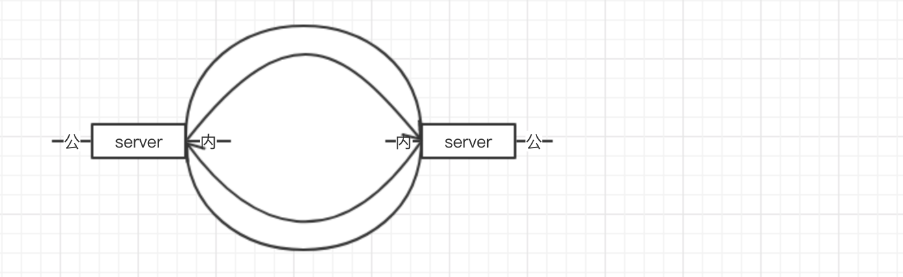

# 原则与思想
1. <Server的内网IP>本质上就是Client。

2. Client需要具备Server功能，它相对于内层的内网子网来说就是Server。

3. 如果Node失去连接，在集群中更新Active为Inactive，可以认为是服务器宕机、网络中断/波动、程序关闭几种情况。全局集群信息不做更改。[S_Count和Node_Count都不动] // **[需要进一步补充]**

   ### 集群拓扑记录形式

   每一个具体的 IP类型信息，路由，... ， 上都带一个 S_count 戳，用于同步，一般情况下旧count的值更新成新count的值。count 可以做出循环形式以防溢出 (大于号自定义，小于-10000的值是大于+10000的值的。)

   Node上有一个Node_Count，其它信息上有一个S_Count。inactive变active时，如果IP环境发生变化，Node_Count加1，其它信息全部删除。合并时如果 Node_Count 不同，须将 Node_Count 小的集群信息中所有该 Node 相关的其它信息删除，再合并。

   ```
   #集群包含的信息有
   1.节点列表
   【NodeA[Node_Count]-> IP1/server[S_Count,Validity],IP2/unknown[S_Count,Validity], IP3/unknown[S_Count,Validity],IP4/client[S_Count,Validity],IP5/client[S_Count,Validity]...;Server=true[S_Count,Validity];Active[S_Count,Validity]】
   【NodeX-> serverIP1.../unknowIP1,unknowIP2.../clientIP1,clientIP2…;Server=false;Active】
   ...
   
   2.内网块信息 (NodeA 改成 NodeA_ClientIP1)
   NetSet1	  |->NetSet1.1	|->NodeA[S_Count,Validity],NodeB
      	     			  				|->NetSet1.1.1	|->NodeList
      	    	...
   
   NetSetN   |->NetSetN.1	|->NodeList
   
   [和直通列表重复，可去除] ServerList
   
   3.带宽和时延信息
   [NodeA, NodeB]->width=X[S_Count,Validity],delay=Y[S_Count,Validity]
   ...
   
   4.直接通信列表(相对公网IP) 
   n=5; //向5个节点发心跳包
   NodeA->NodeB_IP0:	Y(可以直通)+IP[A,C][D][S_Count,Validity]  {IP1:Port1:Count,IP2:Port2:Count,IP3:Port3:Count 路由出性质, 已经出现过的IP和端口列表。如果为D记录IP否则，IP置X}
   NodeA->NodeB_IP1:	Y+IP[A,C][R][S_Count,Validity]
   NodeA->NodeC_IP:	N(不可以直通)[S_Count,Validity]
   注：
   a.[A,C]代表路由出入性质，A代表clientIP1的路由出性质为A，C代表clientIP1的路由入性质为C。多了一个D出入性质，会有一个出现过的IP地址列表。
   b.[D]代表没有经过路由转换(在同一层网络)Direct，此时出入性质对应一般就是[A,A]，[R]代表经过路由转换(不在同一层网络，记录外网IP)，Route
   ...
   
   5.打洞成功记录(记录路由IP)
   默认打洞周期 T
   [NodeA,NodeB]->[IP_A:XXX, IP_B:XXX][S_Count,Validity]
   
   ==============本地信息===============
   1.1 本地IP刷新周期 Tl=1h，下次刷新时间yyyy/mm/dd,hh:mm:ss
   
   5.1 打洞成功心跳包时延 [记录在本地]
   [NodeA,NodeB]->t  经过调整，心跳包以这个时延发送比较合适。
   
   6.打洞失败次数记录 [记录在NodeA本地]
   [NodeA, NodeB]->n次失败，目前打洞尝试时延Tn，下次打洞时间yyyy/mm/dd,hh:mm:ss
   ```


# 集群搭建

### 1.初始搭建 

**./net start serverIP1 [, serverIP2, infofile=xxx.json]**

[1] 在搭建集群的初始阶段，最开始有一个存在 公网IP 的 Server，并对自己做clientIP的判断[规则2-1]。

可选: 为该server指定多个serverIP，可以指定一个初始infofile作为已知网络的构成的初始集群信息，将infofile里所有其它节点都设置为Inactive。

[注: 这里的infofile一般是以前的一个网络，希望继续沿用时进行。]

[2] 如果infofile不存在, 使用唯一码生成器生成NodeA的ID. 按规则2-1对自己的所有IP进行简单IP判断，把明确的内网IP标定。[规则2-1] 

集群信息记录(无infofile时)为:

```
【NodeAID-> serverIP1.../unknowIP1,unknowIP2.../clientIP1,clientIP2…;Server=true;Active】
```


### 2.集群中加入新的Node

**./net join serverIP [-f]**   可选参数-f表示不使用缓存

[1] (同1-2) 如果本地infofile不存在, 每个要加入的Node首先使用唯一码生成器生成自己NodeX的ID.  按规则2-1对自己的所有IP进行简单IP判断，把明确的内网IP标定，暂存在本地节点供后续步骤使用。[规则2-1] 

[2] 如果有参数 -f 则直接执行步骤3，否则按步骤[2-1]校对本地集群缓存信息infofile，如果缓存信息中的IP地址与当前自身的IP地址全部对应，则认为位置没有发生变化，只是节点重启。沿用之前的全局集群信息infofile，但是自身打洞信息应该更新端口号为unknown，**步骤2结束**！如果发生变化，Node上的Node_Count加1，所有与该Node相关的其它信息全部删除，执行步骤[3]

[3-A] 向 serverIP（给定的参数）发 Register 消息。

```
Message=Register，【NodeX-> unknowIP1,unknowIP2.../clientIP1,clientIP2...;Server=false】
```

[3-B] Server 收到 Register 的消息

首先生成一份*临时全局集群信息*准备发给NodeX，加入NodeX的信息

```
【NodeA-> serverIP1.../unknowIP1,unknowIP2.../clientIP1,clientIP2…;Server=true;Active】
...
【NodeX->unknowIP1,unknowIP2.../clientIP1,clientIP2...;Server=false;Active】
```

接着进行[规则2-2] ，由接收方的源地址判断IP是否为公网IP以及路由信息，更新到临时集群信息

```
#一个例子
1.节点信息
【NodeA-> serverIP1.../unknowIP1,unknowIP2.../clientIP1,clientIP2…;Server=true;Active】
...
【NodeX-> serverIP1.../unknowIP1,unknowIP2.../clientIP1,clientIP2...;Server=true;Active】

2.路由信息
[NodeA,NodeX]->{NodeX->NodeA=[N]IP1}
```

Server向NodeX回复*临时集群信息*。

```
Message=R_Register，【cluster_info】
```

[4] 接收到serverIP的返回的临时集群信息后，对集群中除serverIP的 其他Active的公网IP 发送Register消息，等待各个Server回复。

并在最后对收到的所有回复*临时集群信息*做合并。合并规则如果Node_Count相同，使用S_count大的值覆盖S_count小的值，否则所有与该Node有关的信息都以Node_Count大的值为准，初始生成的count都是0. 

如果发生强冲突，即两个server来的消息count一致但值不一致，则通知它们Recheck，接收Recheck之后的集群信息。

Message=Recheck，【冲突的信息，通知Server recheck的内容。】

[注: 合并与自身有关的信息：将unknownIP尽量写成serverIP/clientIP, 路由信息简单写在一起。count大的值覆盖count小的值是包括在这里面的。]

```
#一个例子
1.自身信息
【NodeX-> serverIP1,serverIP2.../unknowIP1,.../clientIP1,clientIP2...;Server=true;Active】
2.路由信息
[NodeA,NodeX]->{NodeX->NodeA=[N]IP1}
[NodeB,NodeX]->{NodeX->NodeB=[Y]IP2}
...
```

[5] 将合并好的结果写入磁盘，发送给所有server进行全局集群信息的更新。每个Server接收到之后就直接合并到各自的全局信息中，合并规则就是count规则。

[注: 这里的思路是每个节点的*本地全局集群信息*更新时就做一次保存，保存成infofile。]

```
Message=Register_E，【cluster_info】
```

[注: 如果NodeX暂定为Client，向Server发送心跳包保持通讯，以防Server想联系该Client的时候失联。]

<u>[6] 需要在初始就启动一下哪些周期性操作? 注明一下，怎样启动。</u>

需要启动的周期性操作：直通、时延、路由、心跳包（Client）、unknownIP检测（Server）

启动方式：在将集群信息写入磁盘后，由Node自己发起

### 3.周期性操作

#### 1.Server发起

(就是新加入Node时的IP类型判断操作，操作上可以统一。)

**内容：**unknownIP检测, 已有的serverIP/clientIP周期性检测

##### unknownIP检测  [规则2-3] 

(新发现serverIP时以新的serverIP必做，其它也是很慢的频率)

使用公网Server向集群中所有的unknowIP发送消息。

```
Message=unknowIP_check，【send_node,unknowIP】
```

如果任意Node接收到unknowIP_check的消息，则消息中的unknowIP更新为公网IP[规则2-3]。

对应unknowIP的S_count+1，并通知其他所有server<u>更新集群信息</u>

##### 已有的 serverIP/clientIP 周期性检测

(clientIP的检测周期可以比unknownIP更慢，serverIP可以不用测，直通检测会自动测，如果直通全部不通，会自动做Node_Count+1。)

[A]每个server向集群中除自己以外的其他serverIP发送消息，内容是目标serverIP

```
Message=serverIP_check，【send_node,serverIP】
```

当server收到serverIP_check的消息时，如果任意消息中，接收到的发送方IP是send_node的源IP，则认为该消息中的serverIP仍然是serverIP。

如果有一个serverIP，没有收到任何符合上述条件的消息，则更新为unknownIP，S_count+1。

[B]每个server向集群中除自己以外的其他clientIP发送消息，内容是目标clientIP

```
Message=clientIP_check，【send_node,clientIP】
```

当server收到clientIP_check的消息时，如果任意消息中，接收到的发送方IP是send_node的源IP，则认为该消息中的clientIP更新为serverIP。否则仍是clientIP。

#### 2.Client发起

##### 打洞尝试/检测 (内网层次确认，具体流程单独写)

（不在直接通信列表中的Client之间才进行）默认打洞周期  T=0.5h

对于任意两个Client之间，打洞失败次数毎增加一次，周期增加，由一个增加策略决定[策略8]   

[A] ClientA与ClientB进行打洞尝试

[1] 如果存在A，B的打洞成功记录(打洞成功记录列表中有对应IP)，则优先使用记录中的IP进行打洞。如果成功，进行步骤[5-1]，否则进行步骤[2]。

[2] 检索内网块信息并进行内网层次划分确认

​	每次进行打洞尝试时，需要对clientA与clientB进行内网层次划分的确认。如果clientX(clientA或clientB)不在任何内网块或者在一个单独的内网块中，则clientX需要向所有clientIP发送消息，进行内网层次划分确认，否则只需要向同一内网块中的clientIP进行确认[可以参考client发起的周期性操作-位置判断/内网层次划分]。如果clientA与clientB的内网层次信息发生了更新，则更新集群信息，并使用新的内网层次信息进行打洞。

​	以下是一种集群内网情况的例子

```
NetSet1(内网块) |->NetSet1.1(子网)	 |->NetSet1.1.1	|->NodeA[S_Count,Validity]
   	     			  		        |->NodeD	   |->NetSet1.1.1.1	|->NodeB
   	    	...							           |->NetSet1.1.1.2	|->NodeC
NetSetN
ServerList
```

​	在此集群信息中，最上层分为N个NetSet代表若干个内网块，除了这些内网块之外，还存在一些不属于任何内网块中的Server。对于每一个内网块，有若干子网和一些不在任何子网中的Node，每一个子网下又有若干子网和不在任何子网中的Node，依次层层递归，构成了整个集群的结构信息。

[3] 判断两个Node是否在同一内网块中。如果在，进行以下操作。*(和位置判断是否和位置判断合并，直接刷内网关系)*

​	【内网间访问规则：内网之间的子网，下层能访问上层，上层不能访问下层】

​	【定义同一个子网：现在的内网块信息中有NodeA、NodeB与NodeC，此时认为NodeA与NodeB在同一子网中，而NodeC与NodeB不在同一子网中。判断依据是NodeB在NodeA所在的最小子网subNet1.1中，NodeB不在NodeC所在的最小子网subNet1.1.2中。即任意两个节点，当一个节点在另一个节点的最小子网中时，认为这两个节点在同一个子网中。】

[3-1]如果两个Client不在同一个子网内 [旁系亲属找共同父节点打洞]

```
NetSet1  |->subNet1	  |->subNet1.1	|->NodeA[S_Count,Validity]
   	     			  |->NodeD		|->subNet1.1.1	|->NodeB
   	    	...						|->subNet1.1.2	|->NodeC
NetSetN
ServerList
```

​	NodeC与NodeB的最近公共上层的节点NodeA并查看直接通信列表，如果直接通信列表中包含以下信息

```
NodeB->NodeA_IP:	Y+IP_B[A,C][S_Count,Validity]
NodeC->NodeA_IP:	Y+IP_C[A,C][S_Count,Validity]
```

​	则NodeC向IP_B打洞，NodeB向IP_C打洞。否则尝试补充直接通信信息，如果没有NodeB-> NodeA_IP的记录就由NodeB向NodeA_IP发起直通测试，测试成功则补全直接通信列表的信息，开始打洞。如果直通测试失败，则寻找【次最近】公共上层节点进行打洞尝试，以此类推。

[3-2]如果两个Client在同一个子网内 [直系亲属直接访问]，那么尝试使用下层Node直接访问上层Node的ClientIP。如现有内网块信息中的NodeA、NodeB，直接使用NodeB访问NodeA。

​	如果访问成功，更新直接通信列表，并且下层的Node持续向上层Node发送心跳包（这样上层的Node记录下接收到的发送方IP后也可以访问下层的Node）。

​	如果不能直接访问，认为含有隐藏的子网层，上层的Node实际上不在上层，而可能在一个并列的子网中。此时使用最小的公共上层Node进行打洞。如现有内网块信息中的NodeA、NodeB，直接使用NodeB访问NodeA失败。此时认为可能存在隐藏层，实际的信息可能是

```
NetSet1	  |->NetSet1.1	|->NetSet1.1.3	|->NodeA[S_Count,Validity]
   	      |->NodeD		|->NetSet1.1.1	|->NodeB
   	    	...			|->NetSet1.1.2	|->NodeC
NetSetN
NodeList
```

​	此时NodeA并不是NodeB的上层即回到两个Client不在同一个子网内的情况，进行[3-1]。

[4] 如果两个Client在不同的内网块中。[找公网IP打洞]

```
NetSet1  |->NetSet1.1	  |->NetSet1.1.1	|->ClientA
		 |->ServerA
NetSet2  |->NetSet1.2	  |->ClientB
		 |->ServerB
		...
NetSetN
NodeList
```

查看直接通信列表，如果直接通信列表中包含以下信息

```
ClientA->ServerB_serverIP:	Y+IP_A[A,C][S_Count,Validity]
ClientB->ServerA_serverIP:	Y+IP_B[A,C][S_Count,Validity]
```

​	则ClientA向IP_B打洞，ClientB向IP_A打洞。否则尝试补充直接通信信息，如果没有ClientA-> ServerB_serverIP的记录就由ClientA向ServerB_serverIP发起直通测试，测试成功则补全直接通信列表的信息，开始打洞。如果直通测试失败，则认为存在墙，寻找对方内网块上的其他Server进行直通并打洞。

​	如果ClientB所在的内网块中没有任何Server节点，则ClientB向直接通信列表中的所有ClientA-> Server_serverIP:Y+IP_A中的IP_A进行扫描。

注：任意打洞情况，如果IP_A路由出性质为C,IP_B路由入性质为C，这种情况是否考虑放弃打洞（太难打通）。

[5-1]如果打洞成功，ClientA与ClientB关闭打洞线程，转为发送心跳包的线程，并向集群发送打洞成功的信号，在集群记录已经打洞成功的Client和他们的端口号，记录形式可以是[ClientA, ClientB] -> [IP_A:XXX, IP_B:XXX]。

[5-2]如果打洞失败，记录打洞失败记录，记录形式可以是[ClientA, ClientB] ->n次。

[B]打洞成功后的心跳包维持。对于存在打洞成功信息的Client，维护私有内存，记录打洞对方Client的最近一次心跳包时间以及第一次心跳包距今的时间。

```
ClientIP:port | last_beat_time | total_beat_time
...
```

如果发现有一Client持续10分钟心跳包丢失，则认为心跳包丢失，重新进行打洞（用心跳包检测打洞信息是否仍然成立）。

##### 心跳包 (周期集成在直通IP里)

【Server不做心跳包，当"直接通信列表"中向某个ServerIP的所有直接连接均为不通N时, Server即为Inactive。
虽然理论上"直接通信列表"中Client向所有ServerIP均连不通时，一样可以判定Client为Inactive，但由于实际判断时，Client只有自己知道不通，该全局信息广播不出去的，故而Client需要一个心跳包机制。】

Client做心跳包的目的在于保证有机器想找该Client时至少可以转发。

在设计时，有两种设计方式，一种是单独做心跳包，第二种是将心跳包集成在刷直通IP的过程中，在经过比较后，认为第二种设计能有效减轻集群符合，故最终选择了第二种设计方式。这里把两种设计的具体方式都列出，可以在论文中进行比较分析。并且探讨了client是否只能向server发送心跳包的问题，最终认为client也可以向client发送心跳包。

【原始设计-心跳包是一个独立模块】

[1] 所有Client每隔1分钟向集群中的n台Server发送一次心跳包，保持连接。(n在配置文件中)

```
Message=heart_beat，[Server1,Server2,Server3,ClientID]
```

[2] 这n台Server记录收到心跳包对应的Client，维护私有内存，记录这些Client的最近一次心跳包时间以及第一次心跳包距今的时间。

```
Server1,Server2,Server3,ClientID | last_beat_time | total_beat_time
...
```

[3] 如果任意ServerA发现有一Client持续5分钟心跳包丢失。则有一下两种可能：

a.Client升级为Server，不再发送心跳包

b.Client丢失（退出集群、宕机、网络环境变化成为新的Client等）

[4]此时进行集群信息的检查，如果发现该Client升级为Server，则删除私有内存中的该Client的信息。

如果未发现Client升级为Server，则将Client可能丢失的情况发送给其他两台Server进行确认。

```
Message=client_loss_check，[Server1,Server2,Server3,ClientID]
```

[5]任意一台Server收到client_loss_check的消息后，如果发现消息中的Client仍在给自己发送心跳包，则<u>通知该Client不再向ServerA发送心跳包，改选一个新的Server</u>，并返回给ServerA一条消息

```
Message=client_alive，[Server1,Server2,Server3,ClientID]
```

如果发现消息中的Client不再给自己发送心跳包返回ServerA

```
Message=client_loss，[Server1,Server2,Server3,ClientID]
```

[6]如果收到两条client_loss的消息，则说明该client丢失，更新集群信息，client变为inactive。

如果ServerA收到一条或两条client_alive的消息，则该client没有丢失，但是client发向自己的心跳包无法接收到。

【心跳包在刷直通时进行】

具体做法如下

[1]每个clientX向其他server检验直通时，使用不同的周期T。T可以是毎20min，40min，1h...。其中周期最短的3个直通测试同时是发心跳包的作用。这里不妨设clientX与serverA为20min，clientX与serverB为40min，clientX与serverC为1h。serverA、B、C的选择条件是：他们原来就与clientX可以直通且serverA、B、C之间可以直通（如果clientX与他们不能直通，不能做心跳包）（如果serverA、B、C之间不能直通，他们无法确认clientX丢失的消息）。

```
Message=heart_beat，[T(20min)]，[ServerAID, ServerBID, ServerCID]
```

clientX向这些server发送下次心跳包的时间在T(例子中为20min)之前。

【在此过程中，serverA，serverB，serverC的职能是对等的，使用三台server是为了提高容错性】

[2]clientX实际上可以在10min后毎2分钟向serverA发送一次心跳包。

[3]serverA如果在20min内收到，返回client接收信号，表示client仍然存活，如果没有在20min内收到，通知serverB, serverC（丢失关注事件）[如果马上又收到连通包的话，应该立即向serverB，serverC 发送连通包来做抵消。]，未接收到这个client的心跳包，并更新client到自己的直通为N。

[4]serverB收到serverA发来的client丢失信号后，开始关注clientX [记录一下即可，为了确认断开用的]。

如果在40min内收到clientX的心跳包，serverB可以判断clientX未丢失，但是serverA与clientX无法直联。需要采取的措施：clientX在40min内只收到serverB的回复，需要重新选取server代替serverA。

如果在40min未内收到clientX的心跳包，serverB同样通知serverA, serverC丢失事件。

[5]serverC收到了两个关注丢失事件的信号，进行clientX是否丢失的判断。

如果serverC同样不能收到，则确认clientX丢失。

如果serverC收到clientX的心跳包，则确认clientX未丢失，通知clientX进行心跳包server的替换。

##### 位置判断/内网层次划分

(和路由出入性质判断周期类似)Node_Count +1时需要特别做一次，刚接入的ClientIP需要做一次。平时以一个很低的频率验证一下，应该和网络层次划分更新频率差不多，第一次打洞尝试前做一次，以后的频率大约是打洞尝试频率的1/5左右。

进行位置判断以及内网层次划分[规则3]，主要将client分为两种，不在任何内网块中的client以及已经在内网块中的client。

[A]

[1]对于还不在任何内网块中的client，向集群中所有clientIP发送消息

```
Message=net_set_1，[send_node,NodeA_clientIP]
```

[2]如果没有任何Node收到改Client发来的消息，则该client为一个单独的内网块。（即新建一个内网块，该内网块中只有这一个client）

[3]NodeA收到net_set_1消息后， 更新集群信息，向send_node发送消息

```
NetSet1  	|->subNetX	  |->NodeA
						  |->send_node
		...		
```

```
Message=net_set_2，[send_node,NodeA_clientIP，NetSetInfo]
```

[4-1]如果send_Node能收到net_set_2的消息，则认为NodeA与send_Node在同一层，更新NetSetInfo。

[4-2]如果send_Node未能收到net_set_2的消息，则认为NodeA可能位于自己的上层。发送消息给NodeA

```
Message=net_set_2_loss，[send_node,NodeA_clientIP，NetSetInfo]
```

[5]此时NodeA可以判断send_node位于自己的下层子网，更新集群信息

```
NetSet1  	|->subNetX	  |->NodeA
						  |->subNetX.Y	|->send_node
		...		
```

[B]

[1]对于已经在任意子网块中的client，向同一子网块中的所有非自己节点的clientIP发送消息

```
Message=confirm_s，[send_node,clientIP]
```

[2]如果存在clientIP收到net_set_confirm的消息，<u>返回</u>

```
Message=confirm_r，[send_node,clientIP]
```

[3]如果client收到confirm_r的消息，则认为自己仍在该子网块中。

```
NetSet1  	|->subNetX	  |->NodeA
						  |->NodeB
						  |->send_node
			...					  
			|->subNetY	  |->NodeC
```

[4]对于以上的内网信息情况，send_Node向NodeA与NodeB发送confirm_s的消息，如果NodeA收到此消息而NodeB没有收到，则NodeA会向send_Node返回confirm_r，而NodeB不会返回消息。Nend_Node发现NodeB未收返回消息，会重新发送一次confirm_s。如果3次都没有收到，会认为NodeB宕机了或网络环境发生变化，将NodeB从该内网块中移除。此时NodeB进行A操作。

##### 路由出入性质判断 

(同一个路由应该不用全部测，测第一遍的时候把别的直通列表里相同IP的路由都置上，validity=false，经过一次验证后，如果相同，就validity=true，S_count++; 更新别的直通时，如果不同就不动，相同就validity=true，S_count++ )

Node_Count +1时需要特别做一次，刚接入的Client需要做一次。平时以一个很低的频率验证一下，应该和网络层次划分更新频率差不多，第一次打洞尝试前做一次，以后的频率大约是打洞尝试频率的1/5左右。

对未判断路由出入端口规则的IP进行判断 [规则1]

[1]如果某一目标IP的路由出入性质未定(实际上就是Node_Count +1时需要特别做一次，刚接入的Client需要做一次。)，则该IP对应的ClientX向对应的ServerA的9930，9931，9932这三个端口发送一次消息[端口由刚接入的Server决定，端口非专用]。（这里的对应是指ClientX向该server发送消息时，server接收端显示的IP为目标IP）

```
Message=router_out_check，Server:Port
```

[2]Server可以收到3条来自NodeX的router_out_check消息，获取这3条请求的ip地址和端口号，分别是NodeX_ip:port，NodeX_ip:port2，NodeX_ip:port3。【判断NodeX_ip是否相等，如果IP不等会做3次要求ClientX进行重发，3次重发后IP仍然不等，则出性质为D。】

在通常情况下，ClientX所在的网络环境没有改变，这3条请求的ip应该是相同的。此时进行步骤[3]

如果不相同，则作废这三条请求，回复ClientX端重新发送。

```
Message=router_out_check_retire
```

NodeX收到router_out_check_retire的消息后重新向该Server的9930，9931，9932这三个端口发送一次消息。直至不再收到router_out_check_retire的消息。

【出性质判断】

(出性质A)如果这3条请求的3个端口号完全相同，可以认为NodeX_ip路由出时，端口号固定不变。

(出性质B)如果这3条请求的3个端口号之间存在一定规律变化(22345，22346，22347)，可以认为NodeX_ip路由出时，端口号以一定规律变化(+1)。

(出性质C)如果这3条请求的3个端口号之间杂乱无章，可以认为NodeX_ip路由出时，端口号随机分配。

(出性质D)IP 都不稳定。

判断完毕后，将该条路由出性质更新在直通列表中。

【入性质判断】

[3]如果ip1，ip2，ip3完全相等，用serverA的9930，9934，9935各交叉发送消息给 对应路由_ip，检查Client是否能够收到，消息内容为

```
Message=router_in_check
```

同时serverA发送信号给serverB（serverB的条件是，在直通列表中，NodeX发送给serverB的显示端IP同样是该目标IP），提示serverB发送消息给路由IP，serverB在接收到serverA的提示后，以9930端口向clientA发送一条请求，消息内容为

```
Message=router_in_check，serverIP:port
```

[4]在NodeX_ip侧，在3分钟后，查看统计接收到内容为router_in_check的消息数量

(入性质A)如果接收到了NodeX_ip的4条消息包中router_in_check的消息，消息包中含有serverA的9930，9934，9935端口以及serverB的9930端口信息，可以判断NodeX_ip路由入时，对收到的所有信息进行转发。

(入性质B)如果接收到了NodeX_ip的3条消息包中router_in_check的消息，消息包中含有serverA的9930，9934，9935端口信息，可以判断NodeX_ip路由入时，仅对相同的IP发来的信息进行转发。

(入性质C)如果接收到了NodeX_ip的1条消息包中包含router_in_check的消息，消息包中仅有serverA的9930端口信息，可以判断NodeX_ip路由入时，仅对相同的IP且相同port发来的信息进行转发。

[6]如果发生奇葩情况，serverB的交叉包收到，serverA的交叉包未收到，可以暂定为宽松的入性质，并要求对应server重发以验证。记录路由类型。

#### 3.Node发起

**内容：本地IP刷新，带宽时延，Node之间直通，刷路由，路由出入端口规则**

##### 本地IP刷新

​	每个Node自身，每隔Tl进行一次本地IP的刷新，查看本地IP是否发生变化。如果本地IP完全没有变化则结束。 如果本地有IP发生变化，则对应节点的Node_Count+1，其它已有的IP即使没有变都重新刷新[Validity=false]。发生变化的IP设置成unknown[S_Count=0, Validity=true]，其它和当前Node相关的参数[Validity]均置为false，具体见规则6. [S_Count]优先级高，大的刷小的；相同[S_Count]下，[Validity]优先级低，false刷新true。

特别注意：这里的设计中，Node里的IP上并没有[S_Count, Validity]标记，而是IP的unknown标记上有[S_Count, Validity]标记。并且本地IP刷新时有可能会有多个IP同时发生变化，变化后的IP和变化前的IP也有可能会因为更换网卡之类的操作而没有对应关系。为了简化设计，这里就不在Node里的IP上设置[S_Count, Validity]标记了。如果要引入复杂版的设计，情况会非常复杂，涉及到多个IP同时变化，变多变少时和原来IP的对应关系问题。在我们的Node_Count版本的设计中，不需要考虑这些问题。

##### 时延、直通、刷路由+带宽

​	考虑到对集群网络造成的影响，此操作的应该设置较低频率(暂定为2h一次)，每次进行Node之间直通，刷路由的测试，并且随机选取20%的信息进行带宽时延的测试 ( 新加入节点应该全部刷一次带宽时延 )，一旦发现某个Node的路由和直通信息有更新，认为这个Node有概率发生了网络环境变化，需要对该Node进行全局测试(全部刷一遍直通和路由)。

​	如果在对一个Node进行全局测试时，发现这个node的信息发生大幅变化 (由下面定义)，则认为该Node的网络环境发生变化，Node_Count+1。

​	【定义信息的大幅变化：统计路由信息和直通信息变化的百分比和绝对值，

对于路由信息（clientIP变化即算作路由IP变化）：如果百分比>=80%并且绝对值>=5则认为信息发生大幅变化。

对于直通信息：如果百分比>=30%并且绝对值>=3则认为信息发生大幅变化。

两个信息可以是  与/或  的关系（不妨暂时使用与关系，这些参数应该可以在集群信息中调整）

百分比/绝对值计算公式：

​				百分比=Node的信息变化记录数/Node的原有信息记录总数

​							绝对值=Node的信息变化记录数】

​	此外，在某一个Node从inactive变成active时，需要对此Node的所有带宽、路由、直通信息进行一次全局测试 (全部刷一遍直通和路由)。新加入节点也需要做全局测试。

以下为NodeA->NodeB刷带宽时延+直通+刷路由的过程。

NodeA->NodeB需要进行路由信息，带宽和时延的检测以及直接通信列表信息的检测时，操作如下：

[1]NodeA向NodeB发送消息[NodeA:regular_update]，记录发消息的时间T1。

NodeB如果能收到，记录下接收到的信息[recvIP=IP,message=[NodeA:regular_update]]，立即返回消息[NodeB:regular_update_return]。

如果recvIP是NodeA的IP地址，则更新路由信息[NodeA,NodeB]={NodeA->NodeB=[N]recvIP},

如果recvIP不是NodeA的IP地址，则更新路由信息[NodeA,NodeB]={NodeA->NodeB=[Y]recvIP}。

注：N代表没有经过路由转换，Y代表经过路由转换。

[2]NodeA如果接收到NodeB返回的消息[message=[NodeB:regular_update_return]]，记录接收到消息的时间T2，时延delay = (T2-T1)/2，并将NodeA->NodeB维护在直接通信列表。

[3] 测带宽，30分钟后，NodeA向NodeB发送一个1MB的文件[NodeA:width_test]，记录下发送时的时间T3，NodeB 如果收到，立刻返回信号，NodeA收到[NodeB:width_test_return]，记录下收到返回信号的时间T4，则带宽计算为width = 1MB/(T4-T3-delay*2)。更新集群信息。

##### 集群信息更新

目前设计是集群信息发生变化就广播更新，是否需要在周期性操作中进行集群信息同步。

具体做法是测带宽时进行。

### 4.Node之间通讯

**./net connect NodeID**         (**用户输入转发**)  

[1]NodeA如果发起与NodeB之间的通信，首先查看直接通信列表，如果存在NodeA->NodeB的记录，尝试使用记录中的IP进行直接通信。

如果通信成功，结束连接流程，否则删除直接通信列表中的对应记录，进行步骤[2]

[2]NodeA向NodeB的所有IP发送连接信号

```
Message=connect，【NodeB_IP】
```

NodeB如果收到connect消息，更新直接通信列表NodeA->NodeB:NodeB_IP,并返回

```
Message=sucess_connect
```

此时建立起连接。否则进行步骤[3]

[3]查看打洞成功列表，如果存在NodeA与NodeB的打洞成功记录[NodeA,NodeB]->[IP_A:XXX, IP_B:XXX]，向IP_B:XXX发起连接尝试，并等待NodeB的回复

```
Message=connect，【NodeB_IP】
```

NodeB如果收到connect消息，更新直接通信列表NodeA->NodeB:NodeB_IP,并返回

```
Message=sucess_connect
```

如果NodeA没有收到来自NodeB的回复，则认为打洞记录过期，更新打洞成功记录中的端口号为unknown，并将带宽时延信息表显示给用户，并提示用户给出转发策略文件。

[4]用户将转发策略文件路径参数输入后，系统使用用户指定的方式进行服务器转发，向NodeB通信。

```
#用户文件形式
NodeA->NodeX->NodeY->...->NodeZ->NodeB
```

NodeA首先发给NodeX

```
Message=connect_transform，【Router：NodeX->NodeY->...->NodeZ->NodeB】
```

NodeX再发给下一跳

```
Message=connect_transform，【Router：NodeY->...->NodeZ->NodeB】
```

直到消息转发至NodeB。

【之后可以进行服务器转发策略的研究】

# 规则

## 1.路由出入性质判断

[1]用NodeX向serverA的9930，9931，9932这三个端口发送一次请求
[2]serverA可以收到3条来自NodeX的请求，获取这3条请求的ip地址和端口号，分别是【NodeX_ip:port1】

【NodeX_ip:port2】

【NodeX_ip:port3】
[3]判断NodeX_ip是否相等，在通常情况下，NodeX所在的网络环境没有改变，这3条请求的ip应该是相同的，如果不相同，则作废这三条请求，用serverA的9933端口发送命令给NodeX，提示NodeX端重新发送。

###  路由出性质判断

[1]判断port1，port2，port3是否相等

###### 路由出性质定义

(出性质A)如果这3条请求的3个端口号完全相同，可以认为NodeX_ip路由出时，端口号固定不变。

(出性质B)如果这3条请求的3个端口号之间存在一定规律变化(22345，22346，22347)，可以认为NodeX_ip路由出时，端口号以一定规律变化(+1)。

(出性质C)如果这3条请求的3个端口号之间杂乱无章，可以认为NodeX_ip路由出时，端口号随机分配。

(出性质D)IP 都不稳定。

[2]在serverA端记录下NodeX的3条请求，记录形式可以是 NodeX_ip -> [routerInType]。记录完毕后，发送给其他server进行信息共享。

### 路由入性质判断

[1]如果ip1，ip2，ip3完全相等，用serverA的9930，9934，9935各发送一条返回消息给NodeX_ip，消息内容为

```
Message=router_in_check
```

同时serverA发送信号给serverB，提示serverB发送消息给NodeX_ip，serverB在接收到serverA的提示后，以9930端口向clientA发送一条请求，消息内容为

```
Message=router_in_check，serverIP:port
```

[2]在NodeX_ip侧，在3分钟后，查看统计接收到内容为router_in_check的消息数量

###### 路由入性质定义

(入性质A)如果接收到了NodeX_ip的4条消息包中router_in_check的消息，消息包中含有serverA的9930，9934，9935端口以及serverB的9930端口信息，可以判断NodeX_ip路由入时，对收到的所有信息进行转发。

(入性质B)如果接收到了NodeX_ip的3条消息包中router_in_check的消息，消息包中含有serverA的9930，9934，9935端口信息，可以判断NodeX_ip路由入时，仅对相同的IP发来的信息进行转发。

(入性质C)如果接收到了NodeX_ip的1条消息包中包含ASDFGH的消息，消息包中仅有serverA的9930端口信息，可以判断NodeX_ip路由入时，仅对相同的IP且相同port发来的信息进行转发。

[3]如果发生其他情况，serverB的交叉包收到，serverA的交叉包未收到，可以暂定为宽松的入性质，并要求对应server重发以验证。记录路由类型。

### 路由性质记录

路由性质记录在直通列表中。

## 2. 内网IP vs 公网IP 判断

怎么判断(Server)内网IP还是公网IP，由以下规则判定：

ip段 + server发送请求 + 路由信息判定

[1]  首先直接判断IP段，如果是内网IP，则直接判断，否则如下作进一步考虑。[仅能判断出内网IP]

[2] 参考[规则4] ; 由该IP所在机器向已有的公网Server发送请求，可由接收方的源地址判断。检查接收方的源地址是否为该IP所在机器的本地IP之一: [能判断出内网IP和内网IP]

  -- 如果是，则说明(1)源地址IP是公网IP[如果正好是该待定IP则问题解决]，(2)该IP所在机器向已有公网Server的路由由该源地址IP转发。<u>记录路由</u>

  -- 如果不是，则说明该IP所在机器至少有一个内网IP。[该IP所在机器只有一个本地IP，则该IP为内网IP]

如果以上规则仍不能判定该IP，则使用规则3.

[3] 使用已知公网Server(的公网IP)，向该IP发送请求。(注意，这里公网Server可能会以内网IP发送) [仅能判断出公网IP]

-1.如果收到发来的请求，则检查数据包的源地址:

  -- 如果源地址为Server的公网IP，则该待定IP是公网IP。

  -- 如果源地址为Server的内网IP，则说明公网Server到该IP的路由特殊，在同一个子网。<u>记录路由，记录内网块</u>

  -- 如果源地址都不是，则说明走了公网Server内网路由，且经过了网关的转换。<u>记录路由</u>

-2.如果所有的 Server 发来的请求都没有收到, 则为 [待定IP]，[即完全被墙的公网IP 或者 内网IP, 以后进一步做内网判断时再审查，可以在达到一定Server数量后判定为高概率内网IP]。<u>可能为待定IP记录概率</u>

## 3. Client位置判断及内网层次划分

[1]与网络拓扑中所有的Client和Server的内网IP互相发送消息

[1-A]如果任一方接收到，则在这个内网块中。<u>记录内网块</u>

[1-B]如果所有都没有接收到，则这个Client在一个未知的内网块中，或着这个Client在某个已知内网块的最上层（内网中下层可以直接发给上层）。标记Client在一个新的内网块中并记录这个新的内网块。

在[1-A]的基础上

[2]和相同内网块中的所有其他Server/Client互相发送请求（内网中下层可以发给上层，上层不能发给下层）。

[2-A]如果双方收到，则不存在层次关系。

[2-B]如果一方收到另一方收不到，则可能存在层次关系。

在[2-B]的基础上

如果收方显示的IP与源IP一致，则认为不存在层级关系。

如果不一致，则认为存在层级关系。<u>记录内网信息</u>

[特殊情况1]如果有多个Client/Server收到了但是显示的IP不一致，则说明这个内网块中有多个子网，节点之间有特定的路由。<u>记录内网信息</u>

[特殊情况2]如果有两个节点（Server的内网IP / Client）之间相互无法通信，可能是多个子网，也可能是存在墙。<u>记录内网信息</u>

## 4.双网卡server之间的路由关系

​	考虑到Server在集群中的位置相对稳定，从Server之间关系的角度去考虑，目前想到的单网卡、双网卡Server共有3种类型（仅有一个公网出口，一个公网出口一个内网出口、两个公网出口），在这3种类型Server的基础上，Server之间两两关系一共有6种情况，如下（防火墙的情况没有作图，只需在连接箭头上添加单向防火墙）：

​	其中路由关系由接收方得到的源IP获知发送方的路由得到。

[A]serverA仅有一个公网出口，serverB仅有一个公网出口，AB通过公网交互


[B]erverA仅有一个公网出口，serverB有个公网出口一个内网出口，AB通过公网交互


[C]serverA仅有一个公网出口，serverB有两个公网出口b1,b2，AB通过公网交互。

A->B通过b1,B-A通过b1


A->B通过b1,B-A通过b2


[D]serverA有一个公网出口一个内网出口，serverB有一个公网出口一个内网出口。

AB通过内网交互



AB通过公网交互


[E]serverA有一个公网出口一个内网出口，serverB有两个公网出口b1,b2，AB通过公网交互。

A->B通过b1,B-A通过b1


A->B通过b1,B-A通过b2


[F]serverA有两个公网出口a1,a2，serverB有两个公网出口b1,b2，AB通过公网交互，这又分为几种小情况，如图


## 5.服务器转发策略（待定）

A.根据通信的信息以及节点关系计算带宽时延邻接矩阵

假如NodeA要与NodeB通信，发送的文件大小为5ms，则计算“带宽-时延”矩阵，计算方式为Dis(i,j) = 5m/width(i,j)+delay(i,j),其中单位为ms，9999代表无法通信。

Node/Node	A	B	C	D	E

​	A		   0       9999  10       15      17 

​	B		9999     0       20      21      41

​	C		  10        20       0        5       90

​	D		  15        21        5        0       45

​	E                  17         41      90     45       0

假设以上是某一时间集群的带宽时延邻接矩阵。

NodeA与NodeB要使用服务器转发策略进行通信，转化为A-B的最短路径问题。

B.Dijkstra算法计算最短路径

[1]首先声明一个Dis数组，初始化的值为

Dis	->	|	0	|	9999	|	10	|	15	|	17	|

顶点集T={A}

[2]找出离A最近的点C,更新顶点集T={A,C}，Dis(A,C) = 10变为确定值，与T最近的点为D，Dis(A,D)=Dis(A,C)+Dis(C,D),因此Dis(A,C)=15不变，Dis(A,D) = 15变为确定值。

[3]更新顶点集T={A,C,D}，与T最近的点为E，Dis(A,E)=17不变，变为确定值。

[4]更新顶点集T={A,C,D,E}，剩下点B，Dis(A,B)=Dis(A,C)+Dis(C,B)=30。更新

Dis	->	|	0	|	30	|	10	|	15	|	17	|

路径为A->C->B,选此为服务器转发策略。

## 6.合并规则count规则

​	考虑到集群是一个分布式环境，所有Node共享一份集群信息，必定在一些时刻，会有Node之间的集群信息不一致，比如说NodeA网络环境发生了变化，自身信息的更新导致了NodeA上的集群信息发生了更新，此时NodeA会通知其他节点进行信息的修改。如果NodeB收到了来自NodeA发来的集群信息更新信号，那么需要将NodeA发来的信息与自己目前的集群信息进行合并，在合并时，会有一些信息冲突。因此需要标记位来标记哪一条信息是最新更新的信息，以此解决合并时的冲突。

​	在设计时，使用到了3个标记位，分别是Node_Count，S_Count，Validity。

优先级Node_Count>S_Count>Validity, Node_Count 高时不仅更新Node，且更新所有与该Node相关的信息。S_Count置0时，一般是信息发生了变化。

​	这三个标记位的作用和更新规则如下。

####  1.新的信息就加

​	Node_Count：对于所有的Node有一个Node_Count的标记位，用来记录该Node的网络环境变化次数。Node_Count只标记在节点上。有了Node_Count之后，在合并时，如果发现同一个Node的信息有冲突，则以Node_Count大的信息为准（认为Node_Count大的是更新过的信息）。具体的更新规则是每次Node的网络环境/IP发生变化时，Node_Count+1。

​	Reliable与Node_Count配套使用，Node_Count的变化触发Reliable变化机制。在Node_Count发生变化时，通常是网络环境发生了变化，此时关于该Node的所有信息可能都不再有效。比如说一台笔记本从南京大学的校园网环境变成了手机热点，那么该Node与其他Node的所有信息，包括路由、带宽、打洞记录都不再适用。但是也存在一种情况，可能是这台笔记本仍然在南京大学的校园网环境内，但是期间有网络卡顿，导致校园网分配给该笔记本的内网IP发生了变化，此时虽然网络环境发生了变化，但是带宽时延、打洞信息等可能仍然有效。因此在Node_Count+1时，希望不是简单删除该集群中这个Node原有的信息，而是有一个标记位，标记这些信息为Unreliable，表示这些信息不再可信但是仍有参考的意义。

 	S_Count：对于所有的集群信息，比如说Node的IP是serverIP还是clientIP，Node之间的带宽、时延等都有一个S_Count的标记位，S_Count只标记在集群的细节信息上，不标记在Node或者IP上。有了S_Count之后，在合并时，如果发现某一个Node的一些细节信息有冲突，且他们的Node_Count相同，则以S_Count大的信息为准（认为S_Count大的是更新过的信息）。S_Count的更新规则是：每次对某一条具体信息(某一节点的某个具体IP从unknownIP确认为serverIP/clientIP，或者是某一路由信息发生变化，打洞成功的记录失效等等)做刷新时，S_Count+1。

​	在集群运行较长时间后，Node_Count和S_Count的值可能会达到整数型的上限，为防止count的值溢出，count在更新和比较时可以使用循环机制（例如:count从0开始增加，在达到100000时，下一次增加变为-99999，再正常增长以此循环。在比较大小时，可以认为-80000>80000，依据是同一个值的更新次数不会差距过大）。

#### 2.count判断信息的新旧

​	在更新全局集群信息时，根据count的大小来判断信息的新旧，原则是count数越大认为经过的判断/信息刷新次数就越多，如果两条信息不一致，则使用count大的值覆盖count小的值。如果两条信息的Node_Count和S_Count都不相同，优先使用Node_Count较大的信息。

​	如果Node_Count和S_Count都相同但是一条信息为Reliable，并一条信息为Unreliable，则优先使用Reliable的信息。

#### 3.冲突就recheck

​       同时在S_Count=5的基础上，由两个主机分别更新了同一条信息，S_Count变成6.

​	Node_Count，S_Count，Reliable这三个标记位能较大程度上定义并时的规则。但是仍然有一些情况，比如NodeD的某一IP原来是UnknownIP，此时NodeA与NodeC同时给NodeD的该IP是ServerIP还是ClientIP进行的判断，NodeA判断为ServerIP而NodeC判断为了ClientIP，且该信息的S_Count在NodeA与NodeC上都进行了更新操作。NodeA与NodeC在合并时，会发现集群信息中的这一条记录有冲突，他们的Node_Count和S_Count都相同且不存在Unreliable的信息，这种情况的冲突出现时，需要进行recheck的操作，具体操作方式如下：

​	如果是节点的IP标记，重新更新集群信息中的此IP标记为unknown，更新count+1，发送给全局。在下次周期性操作时，进行recheck。

​	如果是其他信息（除节点IP信息外，比如路由信息，内网块信息，直接通信列表中的冲突），将对应信息的Validity置false(任选其中一份信息作为合并后的信息即可)。


## 7.全局集群信息的硬盘写入

​	考虑到Client节点的不稳定性，可能会出现短时间的网络波动等情况。因此希望每个Node能在自己本地备份一份集群信息，便于在重新加入集群（恢复连接）时，可以快速启动。因此对每个Node，在本地磁盘备份了一份全局集群信息infofile，在重启时，首先使用这份infofile文件加入到内存作为集群信息。再向集群请求最新的集群信息，并更新infofile。如果内存中的全局集群信息有更新，就更新文件infofile。

## 8.打洞时延增加策略
​	在集群中存在众多Client，这些Client之间有些是无法打洞成功的，如果无法打洞成功的Client仍然以固定时延去进行打洞，会给集群增加没有意义的负担。因此提出了打洞时延增加的概念，随着两个Client之间打洞失败次数的增加，他们之间的时延也会增加。

​	该模块目前仅在Client发起的周期性打洞操作时调用。是一个独立模块。
​	Client打洞时，根据本地的原有信息，输入是原有的时延和目前失败的次数，返回一个新的时延和下次打洞时间。Client收到后，直接更新本地的打洞信息。

​	目前的一种策略:  失败一次+1T（原来为kT，失败一次变为(k+1)T）